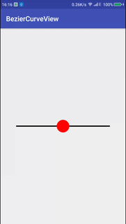
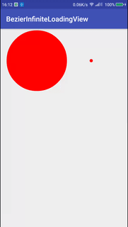
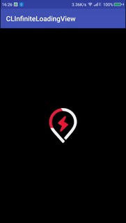
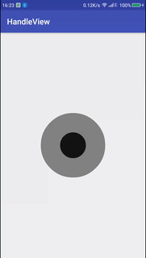
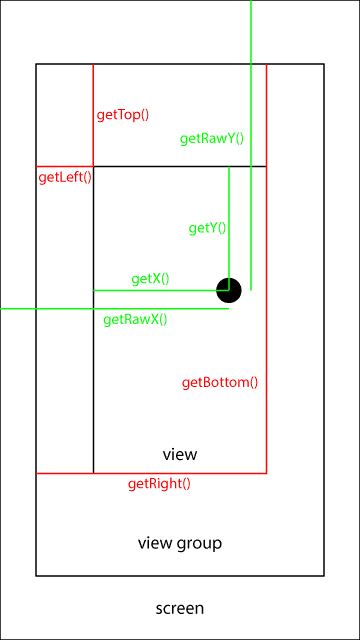
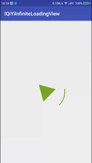
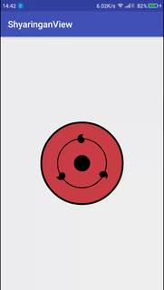
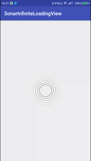
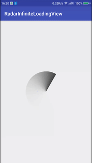
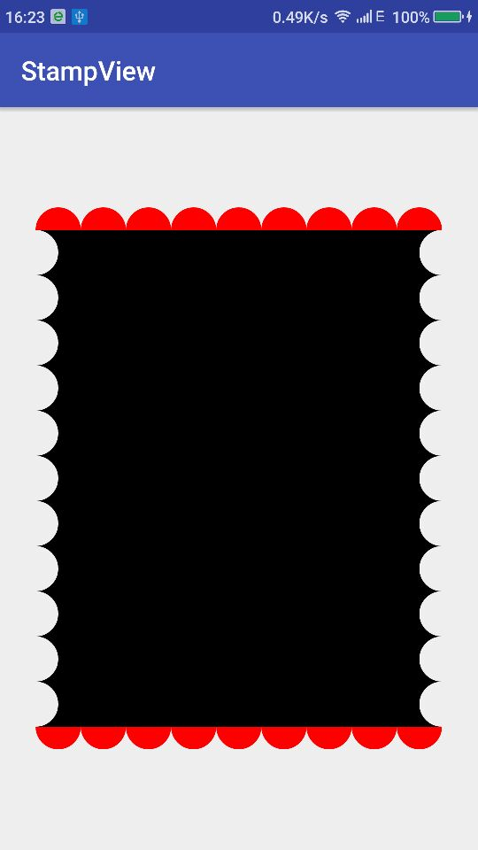

# 自定义View系列知识点及API索引

> [欢迎关注我的简书博客](http://www.jianshu.com/users/2471a8f0e7a5/latest_articles)

## UsingView

### AppbarLayout
### CollapsingToolbarLayout
### CoordinatorLayout

## 自定义View

### BezierCurveView

- Bezier Curve
- DashPathEffect
- onTouchEvent

### BezierInfiniteLoadingView

- Bezier Curve

### CLInfiniteLoadingView

- Xfermode ATOP

### GroupingTagView
标签分组算法

- 等数分组 - 顺序分组
```
 * ** ***** ****** ****** ******** 
 * ** ***** ****** ****** ******** 
 * ** ***** ****** ****** ******** 
 * *** ***** ****** ******* ******** 
 * **** ***** ****** ******* ******** 
 ** **** ***** ****** ******* 
 ** **** ***** ****** ******** 
```

- 等数分组 - 顺序逆序交替分组
```
 * ******** ** ******* ** ****** **** 
 * ******** ** ******* *** ****** **** 
 * ******** ** ******* *** ****** **** 
 * ******** ** ******* *** ****** **** 
 ** ******** ** ******* *** ***** 
 ** ******* ** ****** *** **** 
```

- 等数分组 - 根据所在行剩余容量顺序分组
```
 * *** **** ****** ******* ******** 
 * *** **** ****** ******* ******** 
 ** ** **** ****** ******* ******** 
 ** ** **** ****** ******* ******** 
 ** ** ***** ***** ******* ******* 
 * *** **** ****** ****** 
 * ** ***** ***** ******* 
```

- 等数分组 - 根据所在行剩余容量顺序逆序交替分组
```
 * ******** *** ****** *** ****** 
 * ******** *** ****** *** ****** 
 * ******** ** ******* **** ***** **** 
 * ******** ** ******* **** ***** **** 
 * ******** ** ******* **** ***** ***** 
 ** ******** ** ****** *** ****** ***** 
```

- 不等数分组 - 根据所在行剩余容量逆序分组
```
 ******** ******* ***** **** ** * 
 ******** ******* ***** ***** ** 
 ******** ******* ***** ***** ** 
 ******** ****** ****** **** *** 
 ******** ******* ****** *** *** 
 ******** ******* ***** **** ** * * 
 ******** ****** ****** **** ** * * 
```

- 不等数分组 - 根据所在行剩余容量顺序逆序交替分组
```
 ******** * ******* *** ***** **** 
 ******** ******* ****** *** **** 
 * * * ******** ****** ****** ***** 
 * ******** ** ******* *** ***** **** 
 * ******** ******* ****** **** **** 
 ******** * ** ** *** *** *** ***** **** 
```

### HandleView




- OnTouchListener

### IQiYiInfiniteLoadingView

- canvas.save
- canvas.restore

### MDLikeLinkTextView
- Regex
- Pattern

### PatternView

### ShyaringanView

- canvas.save
- canvas.restore

### SonarInfiniteLoadingView


### RadarInfiniteLoadingView


### StampView

- Xfermode

## Xfermode示例

### PorterDuffXfermode
[原文链接](http://blog.csdn.net/allen315410/article/details/45077165)


### ColorFilter
[原文链接](http://www.cnblogs.com/tianzhijiexian/p/4297104.html)

- ColorMatrixColorFilter
- LightingColorFilter
- PorterDuffColorFilter