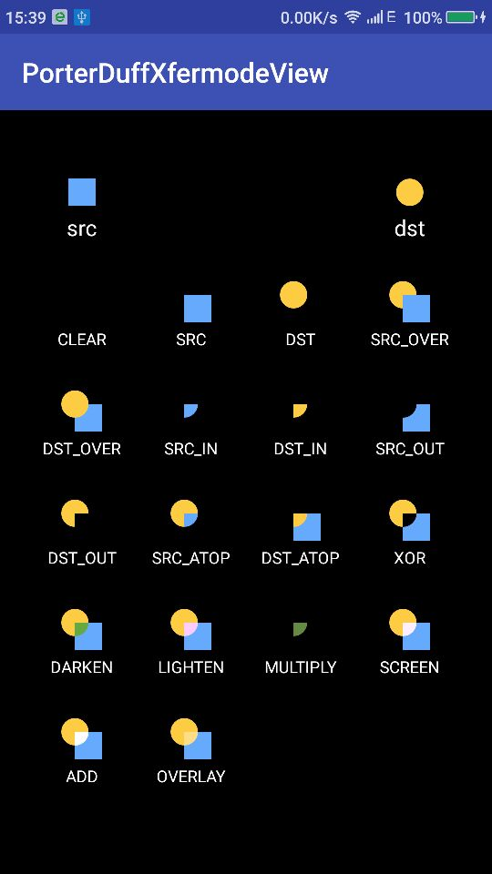

# 自定义View系列知识点及API索引

## 自定义View

### BezierCurveView
- Bezier Curve
- DashPathEffect
- onTouchEvent

### CLInfiniteLoadingView
- Xfermode ATOP

### HandleView

### IQiYiInfiniteLoadingView
- canvas.draw
- canvas.save
- canvas.restore

### SonarInfiniteLoadingView

### RadarInfiniteLoadingView

### StampView
- Xfermode

## Xfermode示例

### PorterDuffXfermode
[原文链接](http://blog.csdn.net/allen315410/article/details/45077165)

### ColorFilter
[原文链接](http://www.cnblogs.com/tianzhijiexian/p/4297104.html)

- ColorMatrixColorFilter
- LightingColorFilter
- PorterDuffColorFilter